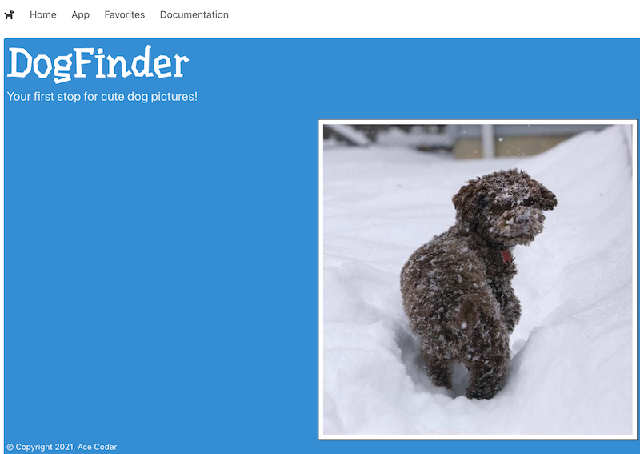
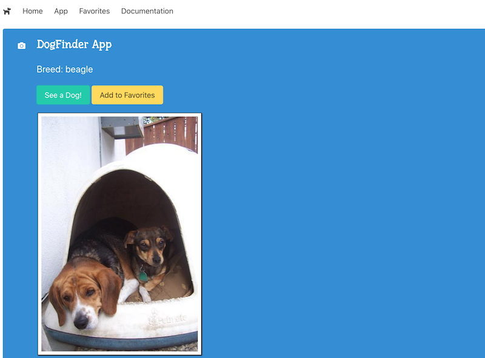
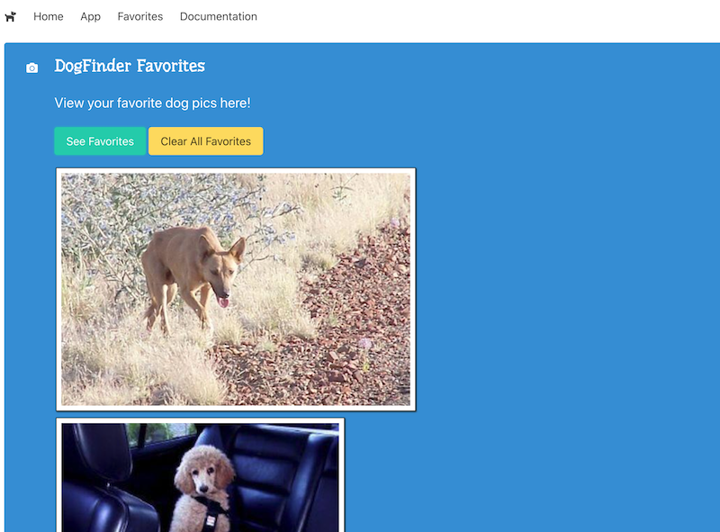
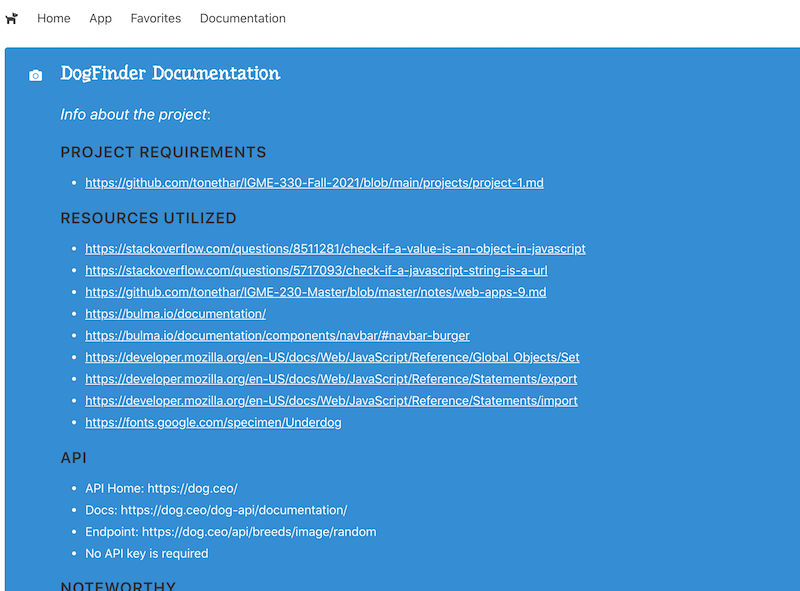
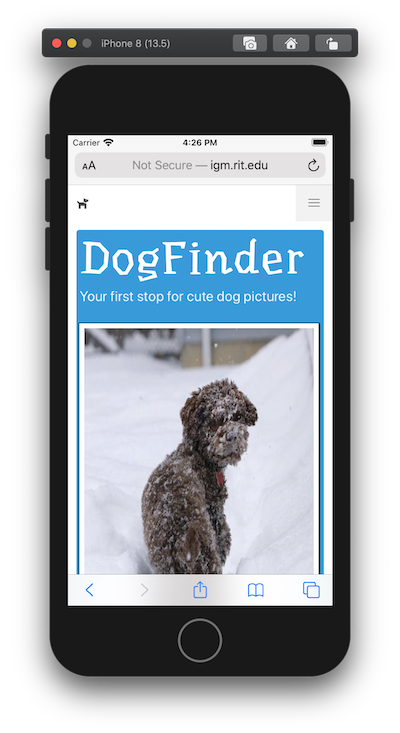
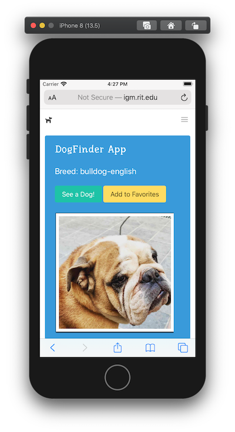
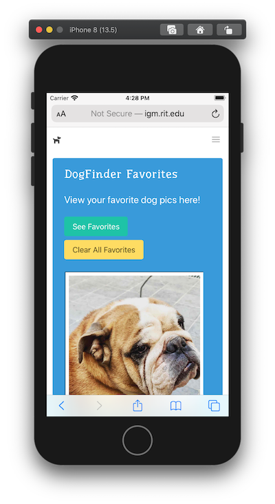
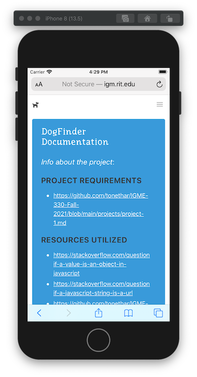

# Project 1 - *VanillaJS App of Awesomeness*

[I. Overview](#overview)

[II. Structure](#structure)

[III. App Functionality & User Experience](#functionality)

[IV. Code](#code)

[V. Media](#media)

[VI. Examples](#examples)

<!--

[VII. Rubric](#rubric)

[VIII. Documentation & Submission](#submission)

-->

<a id="overview"/>

## I. Overview

For this project you are creating a JavaScript driven Web application that utilizes one or more Web services.

- Your goal is to create an application that does something useful, and is easy to use, functional, and aesthetically pleasing.
- The app should serve a purpose - i.e it should be useful to *someone*
- Ideally the experience will run in all modern browsers, but at a bare minimum it must run in recent versions of Chrome.
- The objective of this project is for you to demonstrate your mastery of HTML5/CSS/JS "rich media" programming in a web browser context
- You will be evaluated on:
    - the quality of the experience you create
    - the soundness of your programming
    - meeting the requirements detailed below
    - how far you went beyond what we did in class, as described below

<a id="structure"/>

## II. Structure

1) 4 distinct web pages
    - About (**about.html**) - a "landing" page that tells the users what the app can do
    - App  (**app.html**) - your 
    - Favorites (**favorites.html**)
    - Sources (**sources.html**)

2) A **src** folder

3) A **styles** folder

4) You might also have **fonts**, **images** or **data** folders

<a id="functionality"/>

## III. App Functionality & User Experience

### III-A. Functional Requirements (App page)
1. You must use at least **ONE** distinctive web service APIs in your completed project:
    - i. Try to use an API that supports *CORS* (Cross-origin resource sharing) - but if it does not, you might be able to write a PHP proxy server to fetch the data
    - ii. **CAUTION:** if an API requires an API Key, be sure that there is a generous "free tier", and that the API does not have a short trial period. Approach the following APIs with caution:
      - The YouTube API is severely rate limited - AVOID
      - The Spotify API requires server authentication, and most of the sample code uses Node.js - AVOID 
      - Yelp uses server-side authentication - BUT we posted some sample code in myCourses that you could adapt for your use
      - "Sports Scores" APIs tend to have very short trial periods (7-10 days) and onerous rate limits - AVOID!
      - Always verify that the API returns current data. There's a "gasoline prices" API out there that has 4 year-old data ...
    - iii. Here are some lists of web services:
      - https://github.com/toddmotto/public-apis
      - https://github.com/abhishekbanthia/Public-APIs
      - [www.programmableWeb.com/apis](http://www.programmableWeb.com/apis) has links to thousands of APIs - most free to use with sign-up
      - [developers.google.com](https://developers.google.com/) has over 50 APIs - sign up and then check out their API console
      - [Amazon Web Services (AWS)](https://aws.amazon.com)
      - [RapidAPI](https://rapidapi.com)
      - [Microsoft Azure](https://azure.microsoft.com/en-us/free/)
    - iv. APIs that utilize text:
      - [RiTa.js](https://rednoise.org/rita/)
      - [Wordnik API](https://developer.wordnik.com/faq)
    - v. Game APIs
      - [Giant Bomb Game API](http://www.giantbomb.com/api/)
      - [League of Legends API](https://developer.riotgames.com)
      - [Programmable Web - Game APIs](http://www.programmableweb.com/category/games/apis?category=20098)
    - vi. US Government Data:
      - [USGS Earthquake data](https://earthquake.usgs.gov/fdsnws/event/1/)
      - here's a video that runs through mapping earthquake data --> [Coding Challenge #57: Mapping Earthquake Data](https://www.youtube.com/watch?v=ZiYdOwOrGyc)
      - https://api.nasa.gov
      - [FBI Crime Data API](https://crime-data-explorer.fr.cloud.gov/api)
    - vii. Book information APIs:
      - [www.programmableweb.com/news/53-books-apis-google-books-goodreads-and-sharedbook](http://www.programmableweb.com/news/53-books-apis-google-books-goodreads-and-sharedbook/2012/03/13)
    - viii. Coronavarius:
      - https://rapidapi.com/collection/coronavirus-covid-19
      - https://data.humdata.org/dataset/novel-coronavirus-2019-ncov-cases
      - NYS Case Data: 
        - https://coronavirus.health.ny.gov/county-county-breakdown-positive-cases
        - https://health.data.ny.gov/Health/New-York-State-Statewide-COVID-19-Testing/xdss-u53e/data
        - https://health.data.ny.gov/api/views/xdss-u53e/rows.csv?accessType=DOWNLOAD
      - US County Boundaries: https://www.census.gov/geographies/mapping-files/time-series/geo/carto-boundary-file.html
      - Population data: 
        - https://www.census.gov/programs-surveys/acs/guidance/estimates.html
        - https://www.cdc.gov/csels/dsepd/ss1978/lesson3/section2.html
      - Hospitals: https://hifld-geoplatform.opendata.arcgis.com/datasets/hospitals/data
      - Grocery Stores: https://data.ny.gov/Economic-Development/Retail-Food-Stores/9a8c-vfzj/data
      - Zip Codes Tab areas: 
        - https://www.census.gov/programs-surveys/geography/guidance/geo-areas/zctas.html
        - https://catalog.data.gov/dataset/tiger-line-shapefile-2019-2010-nation-u-s-2010-census-5-digit-zip-code-tabulation-area-zcta5-na
    - ix. Others:
      - Woot deals --> [http://woot.wikia.com/wiki/API](http://woot.wikia.com/wiki/API)
      - Movie info --> [themoviedb.org/documentation/api](https://www.themoviedb.org/documentation/api)
      - Nearby restaurants --> [Yelp API](http://www.yelp.com/developers/documentation)
      - Current weather and forecasts --> [openweathermap.org/api](https://openweathermap.org/api)
      - Business and start-up info --> [data.crunchbase.com/v3.1/docs](https://data.crunchbase.com/v3.1/docs)
    - x. **Another Option - make your own API in PHP (you can do this for ONE of the required APIs):**
      - the data should be useful and not an otherwise widely available subset from another public API
      - you should have **a lot** of data - 50 to 100 records at least
      - the API must have at least 2 [*endpoints*](https://dev.socrata.com/docs/endpoints.html), and be "queryable" - meaning that parameters can be passed to it, and it won't just return the same JSON file everytime it is called
      - the example in the *Project 3 Proposal* dropbox was a database of ice cream stands (which often don't show up in Yelp), similar things would be flea markets, farm stands, etc
      - or another custom dataset (a comprehensive RPG web service?), or ???
    - xi. Here are the "Blacklisted" APIs that you **MAY NOT** use for this project (but if you can envision a compelling use case, just ask us, in advance):
      - Any API from GIPHY - https://developers.giphy.com/docs/ (we love Giphy, but we don't want a bunch of "Giphy Finder++" Apps)
      - The iTunes Search API - https://affiliate.itunes.apple.com/resources/documentation/itunes-store-web-service-search-api/
    - xii. **Important note:** - This is a Web programming class so I expect you to "roll your own" when it comes to adding Web service capability to your pages:
      - That means that JavaScript "widgets" that display (for example) Twitter feeds or the current weather are expressly forbidden
      - You have the knowledge to write these yourself if you desire this sort of functionality in your project.

2. On the app page, you will automatically save the last term searched by the user and other UI *state* in the browser's local storage - this was covered in IGME-230/235 here --> [Web Apps 9 - WebStorage API](https://github.com/tonethar/IGME-230-Master/blob/master/notes/web-apps-9.md):
    - this will also be true of the other controls on the page (&lt;select> tags, radio buttons, checkboxes etc)
    - we are going to test this capability by typing in a search term, selecting some checkboxes, doing a search, and then closing the browser window. When we re-open the window, the user's last search term must be visible, and the rest of the UI should be in the same *state*

3. Other required controls - there will be a MINIMUM of 3 controls that a user can use to filter and display the results. Search buttons or similar don't count towards the 3 controls. For example, [GIF Finder](https://github.com/tonethar/IGME-230-Master/blob/master/notes/HW-gif-finder.md) has these controls:
    - a search button (which doesn't count, and the "reset" button mentioned above does not count either)
    - a search term field (&lt;input>) that the user types into
    - a pulldown (&lt;select>) that the user can use to limit the number of results

    -  **So you will need at least one additional kind of control. What kind of control to use depends on what parameters the web services will allow you to search them on. Here are some ideas:**
       - a **rating** pulldown - if we had this on the GIPHY HW then a user would be able to choose between viewing "G" and "PG" videos for example
       - a **sort by** pulldown to allow the user to view the results sorted A->Z, Z->A, by date, etc 
       - a **date** chooser to filter the results by date - https://developer.mozilla.org/en-US/docs/Web/HTML/Element/input/date
       - **next** and **previous** buttons - another really nice option is to allow the user to "page" through large numbers of results. In the GIPHY HW did you notice that we always get the same 100 "cat" GIFs back when we search?
         - This is because there are ***thousands*** of cat GIFs on GIPHY, and if we don't otherwise specify we will always get them returned from the web service starting at index 0, which means we always get the first 100 (index 0-99) back.
         - We can instead write code that requests a higher starting index.
         - In the GIPHY API this can be done by tracking and adding an `offset` value to the query string that is sent over to the API.

### III-B. Design & Interaction
1) Pleasing graphic design:
    - must use Bulma
    - an *embedded* font must be used - for example from https://fonts.google.com:
      - be cautious about using an ornamental or cursive embedded font for UI labels
      - instead, utilize the embedded font on ornamental elements, like a title or copyright notice
    
2) Widgets are well labeled and follow interface conventions, for example:
    - radio buttons are for mutually exclusive options, checkboxes are for when you want to let the user choose *multiple* options --> https://delib.zendesk.com/hc/en-us/articles/203430309-Radio-button-vs-checkbox-what-s-the-difference-
    
3) Users should be able to figure out how to use the app with minimal instruction:
    - be sure to provide instruction and tooltips if necessary
    
4) User errors must be handled gracefully:
    - for example, if the user forgets to type in a search term before clicking the Search button, the app should tell the user something like "Please enter a search term first"
    
5) Users must know what *state* the app is in at all times:
    - for example, when they click the search button, there should some indication that a search is happening:
      - text that says "Searching for 'Tacos' near you" and so on
      - a "spinner" or other "indeterminate progress" animation --> [Google search "indeterminate progress"](https://www.google.com/search?q=indeterminate+progress&client=safari&rls=en&source=lnms&tbm=isch&sa=X&ved=0ahUKEwj-sNCal4neAhVr34MKHWKqA98Q_AUIDigB&biw=1036&bih=583)
      - here are some "spinner" images you could use (show them when the search starts, and hide them when the search ends): http://ajaxloaders.net/2012/10/spinner-loading-animations-set-1/
      
6) While the app doesn't need to be fully responsive, it should look good on a range of displays. 
    - For example, don't design it just to work on your huge 24" screen at home, as I'll be grading it on a laptop with a 15" screen
    - The main controls of the application must fit in a 1200x800 window (or smaller)

7) Optional Features:
    - Sound:
      - Subtle UI sound *might* be a nice extra, depending on the theme and function of the app
      - Keep your sound file sizes as small as possible. Primarily use MP3's; WAV's are OK for short sound effects
    - UI Animations:
      - https://www.creativebloq.com/features/create-cool-ui-animations-with-css
      - https://www.mockplus.com/blog/post/css-animation-examples
    - Canvas Drawing/Animation:
      - Drawing libraries such as Pixi.js, Three.js, Processing.js and D3.js are allowed
      - Charting web services like Google Charts could also be a nice thing to use (and would count as a second web service)

<a id="code"/>

## IV. Code

1) Code style/standards - [IGME-330 - Course Code Style Requirements](./code-style.md)
    - ES6 modules - at least 4 distinct code files in a **src** folder - ex. **src/loader.js**, **src/main.js**, **src/utils.js**, **src/classes.js**:
      - *No JS code is allowed in your HTML file*
      - Instead, use a single ``
      - your modules will use the [`import`](https://developer.mozilla.org/en-US/docs/Web/JavaScript/Reference/Statements/import) and/or [`export`](https://developer.mozilla.org/en-US/docs/Web/JavaScript/Reference/Statements/export) keywords as needed
    - ES6 classes - at least 2 - put them in **classes.js**
    - Functions
    - Arrays
 
2) Ajax
    - Use [`fetch()`](https://developer.mozilla.org/en-US/docs/Web/API/Fetch_API) and [`fetch.then()`](https://developer.mozilla.org/en-US/docs/Web/API/Fetch_API/Using_Fetch):
      - you may use `.then()` or `await` according to your preference
      - you MUST handle errors with either `.catch()` or `try/catch`
      - *do NOT use `XHR` or `jQuery.ajax()` with this project*

3) PHP
    - a PHP "wrapper" script to your web service is required
    - it must be run from the banjo web server
    - it will accept at least 2 GET parameters (ex. **taco-finder-proxy.php?type=fish&limit=10&location=Rochester,NY**)

4) localStorage - you have already done this in IGME-235 - [9 - WebStorage API](https://github.com/tonethar/IGME-230-Master/blob/master/notes/web-apps-9.md)

5) Utilizes at least 2 [Web Components](https://developer.mozilla.org/en-US/docs/Web/Web_Components)

6) Code Validation:
    - ESLint validation required

7) Other prohibited (in addition to what was mentioned above):
    - *inline event handlers - ex. `<button onclick="doStuff()">Do Stuff!</button>`*
    

<a id="media"/>

## V. Media

- HTML Validation
- CSS Validation
- Images optimized:
  - jpeg,gif,png only
  - scaled down to appropriate dimensions for web delivery
  - *for example, a not cropped or scaled 12MP 4032 x 3024 image is too big, and not allowed*
 - Uses the [Bulma](https://bulma.io/) CSS framework

<a id="examples"/>

## VI. Example Screenshots

- This example meets the basic requirements, and is mobile friendly
- This example would earn about a 90% - to earn a higher grade:
  - **about.html**
    - could use more "flare" - like a component that rotates dog images every 10 seconds or so
  - **app.html**
    - an initial result should "auto load" when the user comes to the page
    - add the ability to get more than 1 result at a time
    - pretty barebones app overall, as the API doesn't give us much to work with (get an additional API)
    - an API that also produced location data would transform the app into a "Dog Adoption" app
  - **favorites.html**
    - better display of results using some sort of a consistently sized "card" for display, and use `float` or `flex` for layout
    - ability to delete and reorder the favorites
    - if there are no favorites, it should say "No favorites yet" or something like that
  - **sources.html**
 

### VI-A. Desktop Version

**about.html**

**app.html**

**favorites.html**

**sources.html**

### VI-B. Mobile Version

**about.html**

**app.html**

**favorites.html**

**sources.html**

