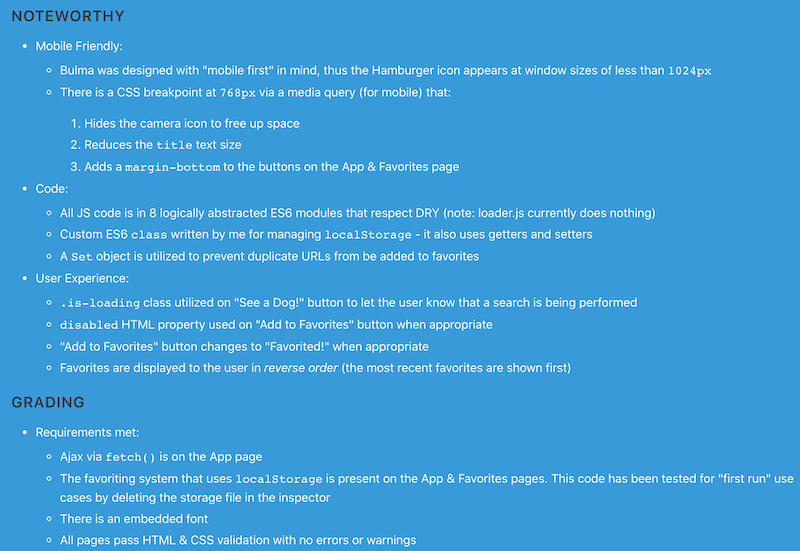
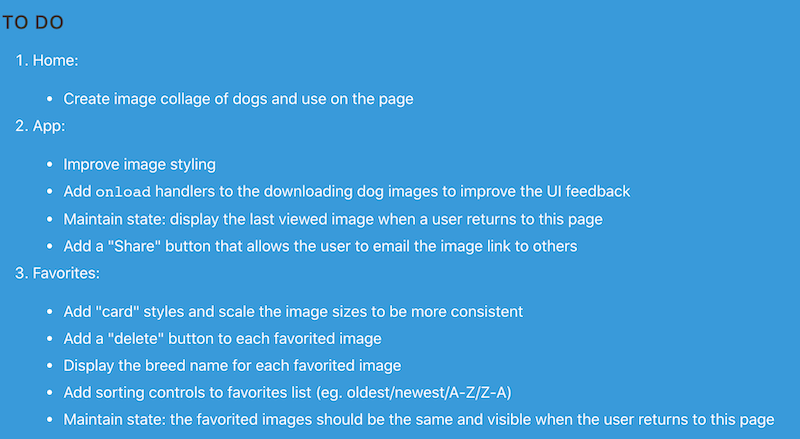

# Project 1 - *VanillaJS App of Awesomeness*

[I. Overview](#overview)

[II. Structure](#structure)

[III. App Functionality & User Experience](#functionality):

- [Home Page](#page-home)
- [App Page](#page-app)
- [Favorites Page](#page-favorites)
- [Documentation Page](#page-documentation)
- [Design & Interaction for ALL pages](#page-design-interaction)

[IV. Code](#code)

[V. Media](#media)

[VI. Examples](#examples)

<!--

[VII. Rubric](#rubric)

[VIII. Documentation & Submission](#submission)

-->

<a id="overview"/>

## I. Overview

For this project you are creating a JavaScript driven Web application that utilizes one or more Web services.

- Your goal is to create an application that does something useful, and is easy to use, functional, and aesthetically pleasing.
- The app should serve a purpose - i.e it should be useful to *someone*
- Ideally the experience will run in all modern browsers, but at a bare minimum it must run in recent versions of Chrome.
- The objective of this project is for you to demonstrate your mastery of HTML5/CSS/JS "rich media" programming in a web browser context
- You will be evaluated on:
    - the quality of the experience you create
    - the soundness of your programming
    - meeting the requirements detailed below
    - how far you went beyond what we did in class, as described below

<a id="structure"/>

## II. Structure

1) 4 distinct web pages
    - About (**home.html** or **about.html**) - a "landing" page that tells the users what the app can do
    - App  (**app.html**) - the main functionality of your app 
    - Favorites (**favorites.html** or **bookmarks.html** or another name that makes sense) - a screen where users can view their "favorites"
    - Sources (**documentation.html** or **sources.html**) - documentation of your sources and a link to your demo video

2) A **src** folder

3) A **styles** folder

4) You might also have **fonts/**, **images/** or **data/** or **src/components/** folders

<a id="functionality"/>

## III. App Functionality & User Experience

<a id="page-home" />

### III-A. Content Requirements (*Home page*)

- Tell the user what your app does
- Have some sort of "brand" for your page:
  - it could be a `navbar-brand` like in the Bulma template - an image or font awesome icon
  - it could be a stylized logo you create yourself
- You might want to use a Bulma `hero`
- There must be at least one image on this page (in addition to whatever appears in `navbar-brand`)
- *Optional: Consider adding some sort interactive content or "flare" to this page - an image carousel, random quotes from happy users, etc*

<a id="page-app" />

### III-B. Functional Requirements (*App page*)
1. You must use at least **ONE** web service API in your completed project:
    - i. Try to use an API that supports *CORS* (Cross-origin resource sharing) - but if it does not, you might be able to write a PHP proxy server to fetch the data
    - ii. **CAUTION:** if an API requires an API Key, be sure that there is a generous "free tier", and that the API does not have a short trial period. Approach the following APIs with caution:
      - The YouTube API is severely rate limited - AVOID
      - The Spotify API requires server authentication, and most of the sample code uses Node.js - AVOID 
      - Yelp uses server-side authentication - BUT we posted some sample code in myCourses that you could adapt for your use
      - "Sports Scores" APIs tend to have very short trial periods (7-10 days) and onerous rate limits - AVOID!
      - Always verify that the API returns current data. There's a "gasoline prices" API out there that has 4 year-old data ...
    - iii. Here are some lists of web services:
      - https://github.com/toddmotto/public-apis
      - https://github.com/abhishekbanthia/Public-APIs
      - [www.programmableWeb.com/apis](http://www.programmableWeb.com/apis) has links to thousands of APIs - most free to use with sign-up
      - [developers.google.com](https://developers.google.com/) has over 50 APIs - sign up and then check out their API console
      - [Amazon Web Services (AWS)](https://aws.amazon.com)
      - [RapidAPI](https://rapidapi.com)
      - [Microsoft Azure](https://azure.microsoft.com/en-us/free/)
    - iv. APIs that utilize text:
      - [RiTa.js](https://rednoise.org/rita/)
      - [Wordnik API](https://developer.wordnik.com/faq)
    - v. Game APIs
      - [Pokemon Go API ](https://rapidapi.com/chewett/api/pokemon-go1)
      - [Giant Bomb Game API](http://www.giantbomb.com/api/)
      - ~~[League of Legends API](https://developer.riotgames.com)~~ (the API key expires every 24-hours!)
      - [Programmable Web - Game APIs](http://www.programmableweb.com/category/games/apis?category=20098)
    - vi. US Government Data:
      - [USGS Earthquake data](https://earthquake.usgs.gov/fdsnws/event/1/)
      - here's a video that runs through mapping earthquake data --> [Coding Challenge #57: Mapping Earthquake Data](https://www.youtube.com/watch?v=ZiYdOwOrGyc)
      - https://api.nasa.gov
      - [FBI Crime Data API](https://crime-data-explorer.fr.cloud.gov/api)
    - vii. Book information APIs:
      - [www.programmableweb.com/news/53-books-apis-google-books-goodreads-and-sharedbook](http://www.programmableweb.com/news/53-books-apis-google-books-goodreads-and-sharedbook/2012/03/13)
    - viii. Coronavarius:
      - https://rapidapi.com/collection/coronavirus-covid-19
      - https://data.humdata.org/dataset/novel-coronavirus-2019-ncov-cases
      - NYS Case Data: 
        - https://coronavirus.health.ny.gov/county-county-breakdown-positive-cases
        - https://health.data.ny.gov/Health/New-York-State-Statewide-COVID-19-Testing/xdss-u53e/data
        - https://health.data.ny.gov/api/views/xdss-u53e/rows.csv?accessType=DOWNLOAD
      - US County Boundaries: https://www.census.gov/geographies/mapping-files/time-series/geo/carto-boundary-file.html
      - Population data: 
        - https://www.census.gov/programs-surveys/acs/guidance/estimates.html
        - https://www.cdc.gov/csels/dsepd/ss1978/lesson3/section2.html
      - Hospitals: https://hifld-geoplatform.opendata.arcgis.com/datasets/hospitals/data
      - Grocery Stores: https://data.ny.gov/Economic-Development/Retail-Food-Stores/9a8c-vfzj/data
      - Zip Codes Tab areas: 
        - https://www.census.gov/programs-surveys/geography/guidance/geo-areas/zctas.html
        - https://catalog.data.gov/dataset/tiger-line-shapefile-2019-2010-nation-u-s-2010-census-5-digit-zip-code-tabulation-area-zcta5-na
    - ix. Others:
      - Woot deals --> [http://woot.wikia.com/wiki/API](http://woot.wikia.com/wiki/API)
      - Movie info --> [themoviedb.org/documentation/api](https://www.themoviedb.org/documentation/api)
      - Nearby restaurants --> [Yelp API](http://www.yelp.com/developers/documentation)
      - Current weather and forecasts --> [openweathermap.org/api](https://openweathermap.org/api)
      - Business and start-up info --> [data.crunchbase.com/v3.1/docs](https://data.crunchbase.com/v3.1/docs)
    - x. Here are the "Blacklisted" APIs that you **MAY NOT** use for this project (but if you can envision a compelling use case, just ask us, in advance):
      - Any API from GIPHY - https://developers.giphy.com/docs/ (we love Giphy, but we don't want a bunch of "Giphy Finder++" Apps)
      - The iTunes Search API - https://affiliate.itunes.apple.com/resources/documentation/itunes-store-web-service-search-api/
    - xi. **Important note:** - This is a Web programming class so I expect you to "roll your own" when it comes to adding Web service capability to your pages:
      - That means that JavaScript "widgets" that display (for example) Twitter feeds or the current weather are expressly forbidden
      - You have the knowledge to write these yourself if you desire this sort of functionality in your project.

2. On the app page, you will automatically save the last term searched by the user and other UI *state* in the browser's local storage - this was covered in IGME-230/235 here --> [Web Apps 9 - WebStorage API](https://github.com/tonethar/IGME-230-Master/blob/master/notes/web-apps-9.md):
    - this will also be true of the other controls on the page (&lt;select> tags, radio buttons, checkboxes etc)
    - we are going to test this capability by typing in a search term, selecting some checkboxes, doing a search, and then closing the browser window. When we re-open the window, the user's last search term must be visible, and the rest of the UI should be in the same *state*

3. Other required controls - there will be a MINIMUM of 3 controls that a user can use to filter and display the results. Search buttons or similar don't count towards the 3 controls. For example, [GIF Finder](https://github.com/tonethar/IGME-230-Master/blob/master/notes/HW-gif-finder.md) has these controls:
    - a search button (which doesn't count, and the "reset" button mentioned above does not count either)
    - a search term field (&lt;input>) that the user types into
    - a pulldown (&lt;select>) that the user can use to limit the number of results

    -  **So you will need at least one additional kind of control. What kind of control to use depends on what parameters the web services will allow you to search them on. Here are some ideas:**
       - a **rating** pulldown - if we had this on the GIPHY HW then a user would be able to choose between viewing "G" and "PG" videos for example
       - a **sort by** pulldown to allow the user to view the results sorted A->Z, Z->A, by date, etc 
       - a **date** chooser to filter the results by date - https://developer.mozilla.org/en-US/docs/Web/HTML/Element/input/date
       - **next** and **previous** buttons - another really nice option is to allow the user to "page" through large numbers of results. In the GIPHY HW did you notice that we always get the same 100 "cat" GIFs back when we search?
         - This is because there are ***thousands*** of cat GIFs on GIPHY, and if we don't otherwise specify we will always get them returned from the web service starting at index 0, which means we always get the first 100 (index 0-99) back.
         - We can instead write code that requests a higher starting index.
         - In the GIPHY API this can be done by tracking and adding an `offset` value to the query string that is sent over to the API.

<a id="page-favorites" />

### III-C. Functional Requirements (*Favorites page*)

- The favorites (or lists or bookmarks) will be stored in `localStorage` and can be viewed on this page
- There MUST be a be a *Delete* button that clears `localStorage` (thus removing the favorites from the page)
- The user will probably be able to interact with the favorites in some way - "View Next 5" and "View Previous 5" etc if there are alot of favorites
- *Optional - the user can also sort, re-order and delete individual favorites*

<a id="page-documentation" />

### III-D. Content Requirements (*Documentation page*)

- Have the following sub-headings on your page (see the [example Desktop screenshots of sources.html](#desktop-screenshots) below
  - PROJECT REQUIREMENTS:
    - provide  a link to this page
  - RESOURCES UTILIZED:
    - cite any and all resources you used on this project, the specific link, including:
      - fonts and images
      - reference sites - ex. developer.mozilla.org
      - "help" sites - ex. stackoverflow.com
      - code snippet sites - ex. CodePen or gists.github.com 
      - tutorial sites - ex. w3schools.com
      - video sites - ex. YouTube or LinkedIn Learning or Udemy
      - blog postings etc
    - Exception: you need not cite any IGME-330 resources/tutorials/HWs:
      - but you MUST cite resources from other courses including IGME-235 
  - API:
    - Link to the API Home, documentation, and endpoints used (but don't include your API key!)
  - NOTEWORTHY:
    - Talk the project up - list the tecnologies you used (web components, Bulma, fetch, promises, etc)
    - Be sure to emphasize what you did outside of what we covered in class
  - GRADING
    - Describe how you met project requirements
    - Describe how you went "above and beyond" project requirements
    - In the comments field of the dropbox, grade your Project 1 submission
  - TO DO
    - List any 

<a id="page-design-interaction" />

### III-E. Design & Interaction (*All pages*)

1) Global Navigation System with "you are here" cues

2) Pleasing graphic design:
    - must use the [Bulma](https://bulma.io/) CSS framework
    - must be mobile friendly (Bulma does this by default)
    - an *embedded* font must be used - for example from https://fonts.google.com:
      - be cautious about using an ornamental or cursive embedded font for UI labels
      - instead, utilize the embedded font on ornamental elements, like a title or copyright notice
    
3) Widgets are well labeled and follow interface conventions, for example:
    - radio buttons are for mutually exclusive options, checkboxes are for when you want to let the user choose *multiple* options --> https://delib.zendesk.com/hc/en-us/articles/203430309-Radio-button-vs-checkbox-what-s-the-difference-
    
4) Users should be able to figure out how to use the app with minimal instruction:
    - be sure to provide instruction and tooltips if necessary
    
5) User errors must be handled gracefully:
    - for example, if the user forgets to type in a search term before clicking the Search button, the app should tell the user something like "Please enter a search term first"
    
6) Users must know what *state* the app is in at all times:
    - for example, when they click the search button, there should some indication that a search is happening:
      - text that says "Searching for 'Tacos' near you" and so on
      - a "spinner" or other "indeterminate progress" animation --> [Google search "indeterminate progress"](https://www.google.com/search?q=indeterminate+progress&client=safari&rls=en&source=lnms&tbm=isch&sa=X&ved=0ahUKEwj-sNCal4neAhVr34MKHWKqA98Q_AUIDigB&biw=1036&bih=583)
      - here are some "spinner" images you could use (show them when the search starts, and hide them when the search ends): http://ajaxloaders.net/2012/10/spinner-loading-animations-set-1/
      

7) Optional Features:
    - Sound:
      - Subtle UI sound *might* be a nice extra, depending on the theme and function of the app
      - Keep your sound file sizes as small as possible. Primarily use MP3's; WAV's are OK for short sound effects
    - UI Animations:
      - https://www.creativebloq.com/features/create-cool-ui-animations-with-css
      - https://www.mockplus.com/blog/post/css-animation-examples
    - Canvas Drawing/Animation:
      - Drawing libraries such as Pixi.js, Three.js, Processing.js and D3.js are allowed
      - Charting web services like Google Charts could also be a nice thing to use (and would count as a second web service)

<a id="code" />

## IV. Code

1) Code style/standards - [IGME-330 - Course Code Style Requirements](./code-style.md)
    - ES6 modules - multiple distinct code files in a **src** folder - ex. **src/main.js**, **src/utils.js**, **src/my-component.js**:
      - *each component gets its own JS file*
      - *No JS code is allowed in your HTML file*
        - Instead, use a single ``
      - your modules will use the [`import`](https://developer.mozilla.org/en-US/docs/Web/JavaScript/Reference/Statements/import) and/or [`export`](https://developer.mozilla.org/en-US/docs/Web/JavaScript/Reference/Statements/export) keywords as needed
 
2) Ajax
    - Use [`fetch()`](https://developer.mozilla.org/en-US/docs/Web/API/Fetch_API):
      - you may use `.then()` or `await` according to your preference
      - you MUST handle errors with either `.catch()` or `try/catch`
      - *do NOT use `XHR` or `jQuery.ajax()` with this project*

3) `localStorage` - you have already done this in IGME-235 - [9 - WebStorage API](https://github.com/tonethar/IGME-230-Master/blob/master/notes/web-apps-9.md)

4) Utilize at least 3 [Web Components](https://developer.mozilla.org/en-US/docs/Web/Web_Components)

    

<a id="media"/>

## V. Media

- HTML Validation
- CSS Validation
- Images optimized:
  - jpeg,gif,png only
  - scaled down to appropriate dimensions for web delivery
  - *for example, a not cropped or scaled 12MP 4032 x 3024 image is too big, and not allowed*
 - Uses the [Bulma](https://bulma.io/) CSS framework

<a id="examples"/>

## VI. Example Screenshots

- This example meets most of the basic requirements, and is mobile friendly
- This example is missing some basic controls and other requirements, here are some ideas on how it could be improved:
  - **about.html**
    - could use more "flair" - ([YouTube - Office Space - Minimum Flair](https://www.youtube.com/watch?v=3vdcw415OcQ) & [YouTube - Joanna Quits With Flair](https://www.youtube.com/watch?v=F7SNEdjftno)) - like a component that rotates dog images every 10 seconds or so
  - **app.html**
    - an initial result should "auto load" when the user comes to the page
    - add a "breed" input field that the user can type into
    - add the ability to get more than 1 result at a time
    - pretty barebones app overall, as the API doesn't give us much to work with (get an additional API?)
    - an API that also produced location data would transform the app into a "Dog Adoption" app
  - **favorites.html**
    - better display of results using some sort of a consistently sized "card" for display, and use `float` or `flex` for layout
    - ability to delete and reorder the favorites
    - if there are no favorites, it should say "No favorites yet" or something like that
  - **sources.html**
 

<a id="desktop-screenshots"/>

### VI-A. Desktop Version

**about.html**

**app.html**

**favorites.html**

**sources.html**

### VI-B. Mobile Version

**about.html**

**app.html**

**favorites.html**

**sources.html**

