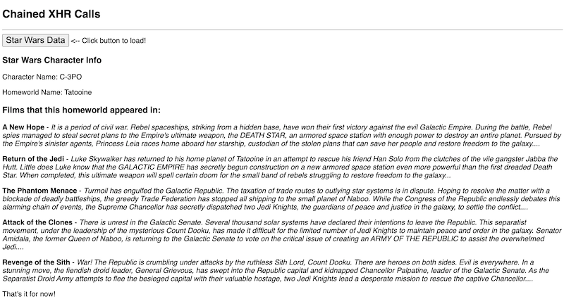

# Week 3A - Finish Up XHR

## I. Review the HW
- Ajax HW
  - [HW - Ajax-3 - loading and parsing XML files](https://github.com/tonethar/IGME-330-Master/blob/master/notes/HW-ajax-3.md)
  - XML parsing:
    - `xhr.responseXML`
    - 5 top rules of *well-formed* XML
    - Is HTML well-formed XML?
    - Any questions?
- [Technobabble IV](https://github.com/tonethar/IGME-330-Master/blob/master/notes/HW-technobabble-4.md)
  - CSV parsing - Any questions?
  - Code Review - issues I noticed:
    - Code Style Issues (but we still don't have a formal "IGME-330 JS Style Guide" for the HW):
      - capitalized function and parameter names (should begin in lowercase except for class names)
      - `var` for variable declarations (should be `const` or `let`)
      - event handlers that are inline in the HTML - ex. - `<button onclick="doStuff()">Click Me</button>` (prohibited in this class, never put JS in the HTML file)
    - Programming Anti-patterns (more serious, we didn't mark off for most of these):
      - re-loading the CSV file on every click of the button
      - initializing the button clicks *before* the data has loaded
      - repeated code that could be factored into a function (DRY)
      - unorganized code (examples):
        - ex. code that executes at the same time not in the same place
        - principle of "least privilege" not followed
        - inconsistent indenting
        - poorly named functions (function names should be descriptive & *self documenting*)
      - unnecessary code (examples):
        - too many functions
        - too much "cut/paste" programming - https://sourcemaking.com/antipatterns/cut-and-paste-programming
      - other:
        - `window.onload=init()` instead of `window.onload=init` (or this code was not needed)
- [Technobabble V](https://github.com/tonethar/IGME-330-Master/blob/master/notes/HW-technobabble-5.md)
  - XML parsing - Any questions?

## II. Upcoming Homework
- You should complete these in the order below (due soon):
  - [HW - Ajax-4 - loading and parsing JSON files](https://github.com/tonethar/IGME-330-Master/blob/master/notes/HW-ajax-4.md)
  - [HW - Technobabble Generator VI - JSON](https://github.com/tonethar/IGME-330-Master/blob/master/notes/HW-technobabble-6.md)
  - [HW - Ajax-5 - the `fetch()` API](https://github.com/tonethar/IGME-330-Master/blob/master/notes/HW-ajax-5.md)

## III. Breakout Groups

- Your mission (with a partner) is to write code that downloads and displays info about popular Star Wars characters
- A common newbie Ajax programaming [anti-pattern](https://en.wikipedia.org/wiki/Anti-pattern) is to send mutiple Ajax requests to a web server by *iterating* (looping) over a collection of URLs - meaning that the browser could be making 5,10,20 or more requests within a few milliseconds. This *rarely* works well. Either the web browser will choke, or the server will return `404` or `500` errors because you are hitting it with too many requests in a short amount of time. Writing code like this also marks you as a *newbie*, and it isn't the kind of thing that you want a potential employer to see
  - Instead, you will *chain* API calls so that when the first API call returns, you will then make a second API call and so on. This making of requests in serial rather than parallel reduces the load on the client and the server, and usaully results in a better user experience (in that your app won't hang up while making a lot of simultaneous requests)
- The web service endpoint you will use has information on Star Wars characters - this one returns JSON about Luke Skywalker - go ahead and try it out in a browser - https://swapi.dev/api/people/1
  - change the number at the end of this url to `2` to get info about C-3PO
  - and so on
- Functionality:
  - clicking the button will:
    - clear the previous results
    - download a random character with a random id between 1 (Luke Skywalker) and 20 (Yoda)
    - display the character's name
    - if the character doesn't exist (#17 does not) handle that error
  - AFTER you have displayed the character's name, make another `XHR` request, this time for the character's `homeworld`
  - AFTER the `homeworld` data has downloaded:
    -  display the `homeworld` name
    -  make another `XHR` request, this time for the first movie in the homeworld's `films` array
      - if the `films` array is empty, let the user know
    -  when the film data shows up, display the `title` and `opening_crawl` of the film:
      - then make a new `XHR` request for the next film
      - and so on, until you run out of films

## III-A. Screenshot of completed version

## III-B. Start Code

- Look in myCourses

<!--
## I. Overview

1) Review [HW-SG-1](https://github.com/tonethar/IGME-330-Master/blob/master/notes/HW-SG-1.md):
  
    - look at "Smiley" submissions
    - concepts covered - this was mostly a review of what we have been doing in class (which is a good thing!)

2) Talk about canvas transformations - here are the notes - [Canvas III - Transformations](https://github.com/tonethar/IGME-330-Master/blob/master/notes/canvas-3.md)
  
     - we will be doing a demo of translate/rotate/scale in class
     - the demo "start" code is in the link above, and up in myCourses there is a "clip" file with some code you can copy/paste 
     - there is an accompanying HW assignment - look in myCourses dropbox for "3A inclass Checkoff" - it is due tonight

<a id="hw" />

3) Other Homework

    - [Animated Sine Wave HW](https://github.com/tonethar/IGME-330-Master/blob/master/notes/HW-sine-wave.md) is due Wednesday night - it doesn't take too long
    - [Canvas SG-2](https://github.com/tonethar/IGME-330-Master/blob/master/notes/HW-SG-2.md) is assigned - see myCourses dropbox
    - 3 "optional" extra credit assignments - some of them are good Project 1 "starters":
      - they are all bonus "extra credit" items
      - the dropboxes for these close Monday night
      - ***you MUST do at least one of them (but you can do all three if you want, for <u>super power-up credits & achievements</u>!)***
      - here they are (for your edification):
        - [Extra Credit - Random Walker](https://github.com/tonethar/IGME-330-Master/blob/master/notes/HW-random-walker.md)
        - [Extra Credit - Conway's Life](https://github.com/tonethar/IGME-330-Master/blob/master/notes/HW-canvas-life.md)
        - [Extra Credit - Lorenz Attractor](https://github.com/tonethar/IGME-330-Master/blob/master/notes/HW-lorenz-attractor.md)
  
<!--
- Review Periodic Functions & Phyllotaxis HW:
  - [HW - Sine Wave](https://github.com/tonethar/IGME-330-Master/blob/master/notes/HW-sine-wave.md)
    - look at submissions
  - [HW - Algorithmic Botany](https://github.com/tonethar/IGME-330-Master/blob/master/notes/HW-algorithmic-botany.md) 
    - look at submissions
- [Project 1](../projects/project-1.md) assigned! 
  - Let's discuss!
  - See dropboxes for due dates
-->

<!--
## II. Lecture/Demo - the JavaScript IIFE
- Stands for "Immediately Invoked Function Expression"
- Using these is one of the requirements for Project 1
- See [IIFE Notes](https://github.com/tonethar/IGME-330-Master/blob/master/notes/IIFE-notes.md) & demo
-->

<!--
## III. Demo - Modifying your "Screen Saver with Controls"
- Go ahead and grab your "Screen Saver with Controls" code from last week:
  - First, we'll re-factor the code by getting rid of ["magic numbers"](https://en.wikipedia.org/wiki/Magic_number_(programming)#Unnamed_numerical_constants) (e.g. Unnamed Numerical values or constants)
  - Next, we'll wrap all of our JS code in an IIFE
  - Then we'll create an ES5 style external "library" of reusable functions named **"abcLIB.js"** by using an IIFE (*abc* will be your initials):
    - time allowing, we'll also take a quick look at how RiTa.js structures their library using an IIFE: https://rednoise.org/rita/download.php
-->

<!--
**Try it:** Once everything is working, move the remaining JS code in your HTML to an external JS file named **index.js**, and then import it with a &lt;script> tag
-->

<!--
## IV. Videos
- These videos were originally linked to on 2A, and will re-cap what we covered in section III. above:
  - [Screen Saver With Controls-5 (22:06)](https://video.rit.edu/Watch/screen-saver-with-controls-5):
    - getting rid of "magic numbers" by adding `canvasWidth`, `canvasHeight` variables, and a `drawParams` object
      - https://en.wikipedia.org/wiki/Magic_number_(programming)
    - using `Object.freeze()` to create an [immutable object](https://en.wikipedia.org/wiki/Immutable_object)
    - using an IIFE ("immediately invoked function expression") to remove our variables and functions from global scope:
      - https://developer.mozilla.org/en-US/docs/Glossary/IIFE
  - [Screen Saver With Controls-6 (15:35)](https://video.rit.edu/Watch/screen-saver-with-controls-6):
    - Creating an ES5 Style JS Library with an IIFE
-->

| <-- Previous Unit | Home | Next Unit -->
| --- | --- | --- 
| [**week-02B-notes.md**](week-02B-notes.md)     |  [**IGME-330 Schedule**](../schedule.md) | [**week-03B-notes.md**](week-03B-notes.md)
