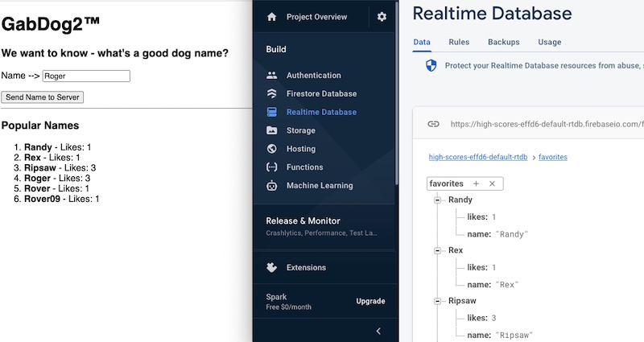

# Week 9B - Finish up Project 2

## I. Project 2
- [Project 2](../projects/project-2.md)
- [Project 1 & 2 - Tips & Tricks](../projects/p1-tips.md)
- [Course Code Style Requirements](../projects/code-style.md)

<hr>

## II. More Firebase - creating a `likes` counter for Dog Names

## II-A. Overview
- What we are going to build is "likes counter" for user submitted dog names
  - every time a use submits a new dog name, it is added to the `favorites/` path, and given a property of `likes: 1`
  - if this dog name already exists in Firebase, the `likes` property of that dog name is incremented by 1
  - here is a screenshot of the completed example app (on the left), and the Fiebase console (on the right)



<hr>

## II-A. Start Code

**gab-dog-1-start.html**

```html

```

<hr>

## II-B. Notes

<hr>

## II-V. Documentation
- `get(path)`
   - Gets the most up-to-date result for this query.
   - https://firebase.google.com/docs/reference/js/database.md#get
   - returns a *Promise* - remember those?
 - `update(path,values)`
   - Writes multiple values to the Database at once.
   - https://firebase.google.com/docs/reference/js/database.md#update
   - returns a *Promise* - remember those?


<hr><hr>


| <-- Previous Unit | Home | Next Unit -->
| --- | --- | --- 
| [**week-09A-notes.md**](week-09A-notes.md)     |  [**IGME-330 Schedule**](../schedule.md) | :-/
